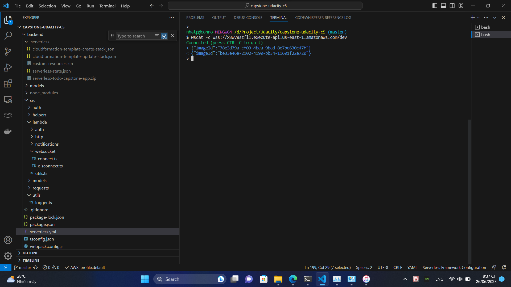

# Serverless TODO

To implement this project, you need to implement a simple TODO application using AWS Lambda and Serverless framework. Search for all comments starting with the `TODO:` in the code to find the placeholders that you need to implement.

# Functionality of the application

This application will allow creating/removing/updating/fetching TODO items. Each TODO item can optionally have an attachment image. Each user only has access to TODO items that he/she has created.

* Additional features: websocket: 
wscat -c wss://x3wv8szfl1.execute-api.us-east-1.amazonaws.com/dev

# TODO items

The application should store TODO items, and each TODO item contains the following fields:

* `todoId` (string) - a unique id for an item
* `createdAt` (string) - date and time when an item was created
* `name` (string) - name of a TODO item (e.g. "Change a light bulb")
* `dueDate` (string) - date and time by which an item should be completed
* `done` (boolean) - true if an item was completed, false otherwise
* `attachmentUrl` (string) (optional) - a URL pointing to an image attached to a TODO item

